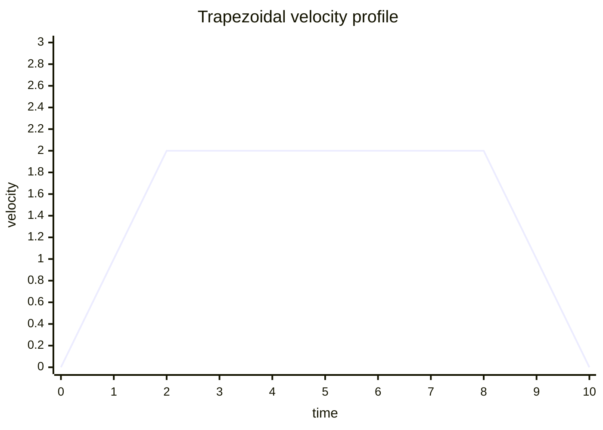
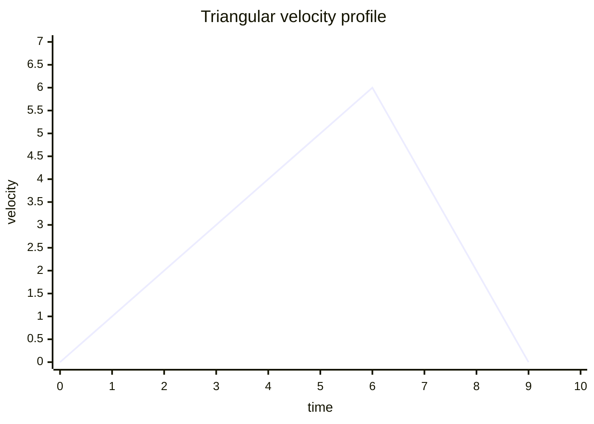
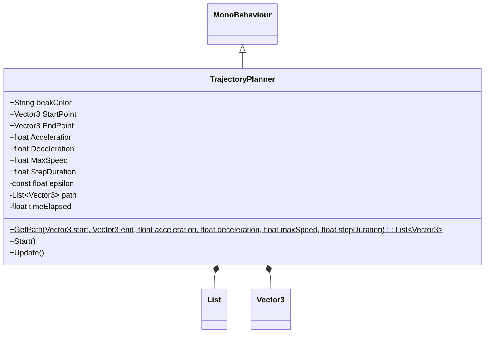

# Introduction

TrajectoryPlanner generates paths with a trapezoidal velocity profile with the inputs:
- start point
- end point
- acceleration
- deceleration
- maximum velocity
- step interval duration

If the maximum velocity cannot be reached before the trajectory is complete, the constant velocity portion of the path will shrink to a point and the path will have a triangular veocity profile. The new maximum velocity is calculated using:

$$Vmax = \sqrt{\frac{2*totalDistance}{\frac{1}{acceleration} + \frac{1}{deceleration}}}$$

# Running TrajectoryPlanner
1. Open the project in Unity.
1. Open SampleScene located in **Assets > Scenes**.
1. Optionally, select Ball in the Hierarchy window, then edit the input parameters in the Inspector window.
1. Press play to see the ball move along the path.

TrajectoryPlanner can be found at **Assets > Scripts**.

# Running Tests
Run tests from the EditMode tab in Test Runner. From the Unity editor. **Window > General > Test Runner > EditMode > Run All**

Unit tests can be found at **Assets > Tests**.

# Class diagram

# Assumptions
1. The use case does not require less than 0.0001f for minimum acceeleration, deceleration, maximum speed, or step interval duration
1. The focus is on accuracy rather than performance. Each point is calculated rather than accumulating an increment.
